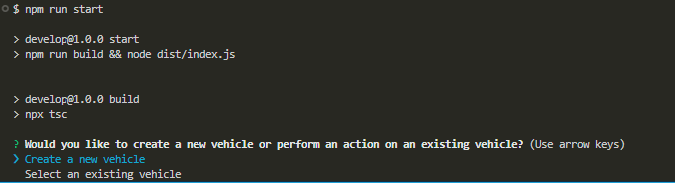
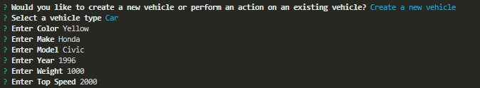

# VehicleBuilder

## Description

VehicleBuilder is a TypeScript command-line application that allows users to create and manage different types of vehicles, including cars, motorbikes, and trucks. The application is designed to provide an interactive experience where users can either create a new vehicle or select an existing one. After selecting a vehicle, users can perform various actions such as driving, refueling, and checking the status of the vehicle.

The motivation for building VehicleBuilder was to create a versatile and extensible application that can handle multiple vehicle types, making it a valuable tool for developers interested in learning TypeScript and object-oriented programming (OOP) principles.

This project helped me deepen my understanding of TypeScript, especially in the areas of class inheritance, interfaces, and modularization. Additionally, I gained experience in designing user-friendly command-line interfaces and handling user input effectively.


## Table of Contents (Optional)

If your README is long, add a table of contents to make it easy for users to find what they need.

- [Installation](#installation)
- [Usage](#usage)
- [Credits](#credits)
- [License](#license)

## Installation

To install VehicleBuilder, follow these steps:

1. **Clone the repository:**
   ```bash
   git clone https://github.com/AdminChatter/VehicleBuilder.git
   ```

2. Navigate to the project directory:
    ```bash
    cd VehicleBuilder
    ```

3. Install the necessary dependencies:
    ```bash
    npm install
    ```

4. Compile the TypeScript code:
    ```bash
    npm run start
    ```

5. Run the application

## Usage

1. Main Menu:
    Upon starting the application, you will be presented with a main menu where you can choose to:

    Create a new vehicle (Car, Motorbike, or Truck)

    Select an existing vehicle

    

2. Creating a New Vehicle:

    When creating a new vehicle, you will be prompted to choose the type of vehicle (Car, Motorbike, or Truck).

    You will then be asked to provide details such as the vehicle's name, engine type, and other specifications.

    After entering the details, the vehicle will be created and saved for future use.

    

3. Selecting an Existing Vehicle
    Once a vehicle is selected, you can perform various actions such as:

    ```bash
        'Print details',
        'Start vehicle',
        'Accelerate 5 MPH',
        'Decelerate 5 MPH',
        'Stop vehicle',
        'Turn right',
        'Turn left',
        'Reverse',
        'Tow',
        'Wheelie',
        'Select or create another vehicle',
        'Exit',
    ```

## Credits

Made by AdminChatter
GitHub: https://github.com/adminchatter

If you have any questions, please contact me at xiangzhenwu.dev@gmail.com

## License

This project is licensed under the [MIT](https://opensource.org/licenses/MIT) license.<BR>
Click the license above to learn more about this license.

## Badges


## Features

## Features

VehicleBuilder includes the following features:

1. **Create and Customize Vehicles:**
   - Build various types of vehicles including Cars, Motorbikes, and Trucks.
   - Customize each vehicle's specifications such as engine type, color, and additional features.

2. **Perform Actions with Vehicles:**
   - Start, stop, accelerate, and brake your vehicles.
   - Display detailed information about each vehicle.

3. **Tow Feature for Trucks:**
   - Trucks have a special towing feature that allows them to tow other vehicles or heavy loads.
   - After selecting a Truck, choose the "Tow" action to simulate towing a load or another vehicle.
   - The application will provide feedback on the towing process, including the truck's performance under load.

4. **Wheelie Feature for Motorbikes:**
   - Motorbikes have a unique wheelie feature that allows them to perform wheelies.
   - After selecting a Motorbike, choose the "Wheelie" action to simulate the motorbike lifting its front wheel off the ground.
   - The application will display the duration and success of the wheelie, adding an element of fun to motorbike handling.


## How to Contribute

If you would like to contribute to this project, please fork the repository and create a pull request. For major changes, please open an issue first to discuss what you would like to change.

## Tests

To run tests, use the following command:
```bash
npm run test
```